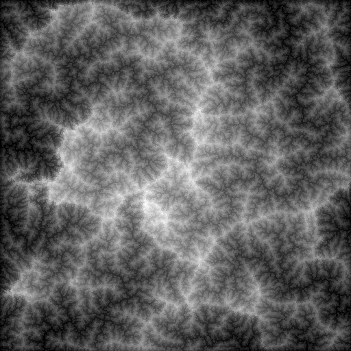
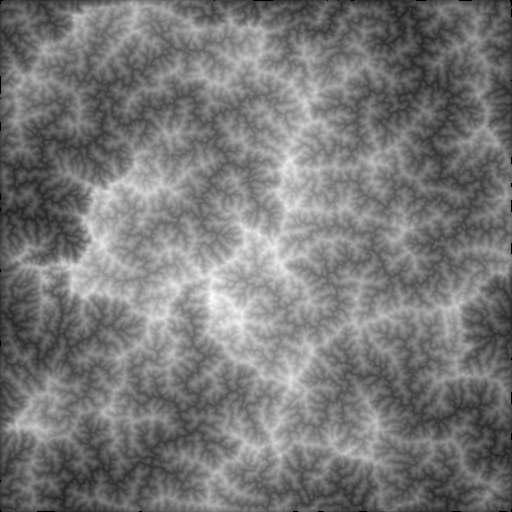

# Erosio

A Java API for fast erosion

## Overview

This project is a Java implementation of [Large Scale Terrain Generation from Tectonic Uplift and Fluvial Erosion](https://inria.hal.science/hal-01262376/document) by Guillaume Cordonnier.
All described methods, excluding 3D rendering, are implemented with similar (slightly faster) computation times.


Erosio's features include:
 - Fluvial erosion with control over uplift, initial height, erosion and precision parameters
 - Interpolation of the samples' heights
 - Reusable geometry inputs for fast repeated generation
 - Polygonal erosion domains


## Example

```java
// Define bounding coordinates
RectI bounds = new RectI(-256, -256, 256, 256);

EroderSettings settings = new EroderSettings(
        /*Uplift*/ p -> 1.0, /*Initial height*/ p -> 0.0,
        /*Erosion rate*/ p -> 2.0, /*m:n ratio*/ 0.5,
        /*Max slope*/ (p, h) -> 30.0,
        /*Time step*/ 1, /*Max iterations*/ 10, /*Convergence threshold*/ 1E-2
);

// Generate geometry input (reusable)
EroderGeometry eroderGeometry = new EroderGeometryNatural(
        EroderGeometry.RectDtoPolygon(bounds.toRectD()), /*Inverse sample density*/ 2, /*Seed*/ 2
);

// Erode
EroderResults results = Eroder.erode(settings, eroderGeometry);

// Interpolate height by nearest neighbor
Interpolator interp = new InterpolatorNN(results);
// at point (2.0, 3.0)
double height = interp.interpolate(2.0, 3.0);
```

<p align="center">
    
    
    
    <br/>
    <em>Resulting heightmap computed in 10 seconds (left NN, center GaussianKernel, right Phong)</em>
</p>

## Usage

Erosio is available via GitHub Packages. Learn more about it
[here](https://docs.github.com/en/packages/working-with-a-github-packages-registry/working-with-the-apache-maven-registry)
(Maven) and [here](https://docs.github.com/en/packages/working-with-a-github-packages-registry/working-with-the-gradle-registry) (Gradle)

#### Gradle
```groovy
dependencies {
    implementation 'com.github.keyboardcat1:erosio:2.2.2'
}
```

#### Maven
```xml
<dependency>
  <groupId>com.github.keyboardcat1</groupId>
  <artifactId>erosio</artifactId>
  <version>2.2.2</version>
</dependency>
```

---

## WIP

- Next version: more work on interpolation
- Version 3.0: GPU optimized


